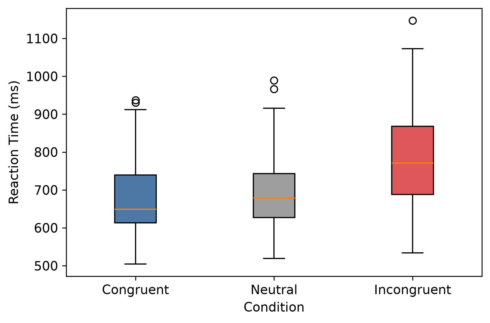
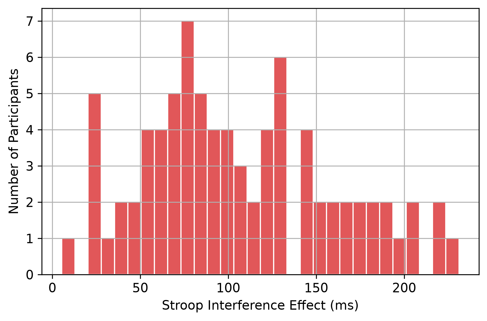
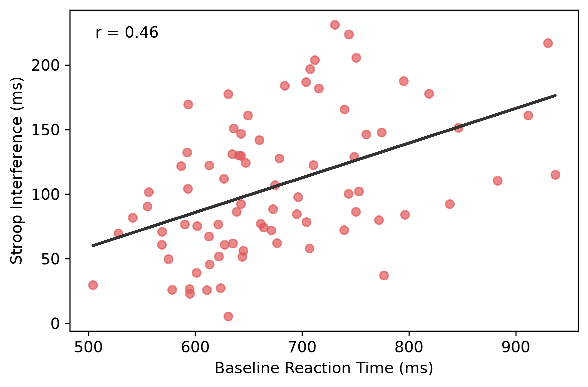
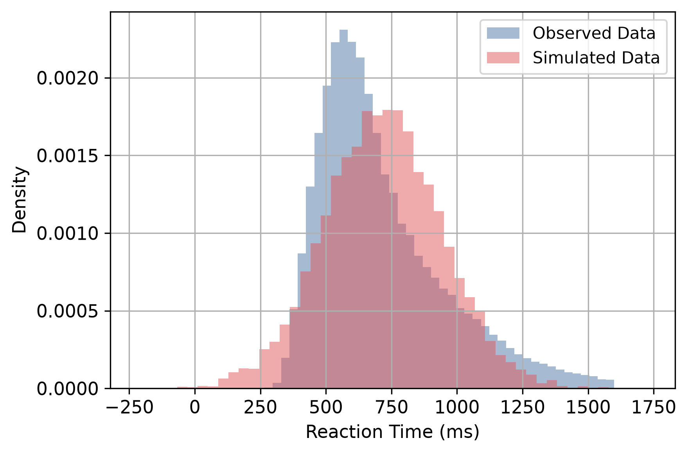

## Overview

This project investigates cognitive interference in the Stroop task using trial-level behavioral data from an openly available experimental dataset. Using data from 81 participants, the study quantifies condition-level differences in reaction time and accuracy, examines individual variability in interference effects, and evaluates whether a simple computational model can reproduce the observed behavioral pattern. The project combines statistical analysis, reproducible data processing, and computational modeling within an open-science workflow.

## Research Question

How does cognitive interference influence reaction time and accuracy during Stroop task performance, and to what extent can a simple computational model reproduce the observed interference pattern?

## Theoretical Background

The Stroop effect is a classic demonstration of cognitive interference, occurring when an automatically processed stimulus dimension conflicts with a task-relevant response dimension. The resulting performance cost has been interpreted through theories of automaticity, selective attention, response conflict, and cognitive control. This project examines the phenomenon from a behavioral and computational perspective, emphasizing reproducible measurement and model-based explanation.

## Dataset

The analysis used an openly available Stroop-task dataset from the Open Science Framework (OSF), comprising behavioral data from 81 participants across 85 recording sessions. The dataset included trial-level reaction time, accuracy, experimental condition, and participant identifiers collected during congruent, neutral, and incongruent Stroop trials. Preprocessing involved removing probe trials, excluding invalid and extreme reaction times, resolving participant–session identifiers, and aggregating observations at the participant level for inferential analyses.

## Methods

The analysis pipeline included data cleaning, quality control, descriptive statistics, and inferential testing. Stroop interference was quantified as the participant-level difference between incongruent and congruent reaction times. Statistical analyses included paired-samples t-tests, effect-size estimation, confidence intervals, and assumption diagnostics. A simple additive computational model was implemented to evaluate whether condition-level behavioral patterns could be reproduced through a baseline-plus-interference framework.

## Key Findings

* Reaction times increased systematically from congruent to neutral to incongruent conditions.
* Mean Stroop interference effect: **106.3 ms**
* Statistical evidence for interference: **t(80) = 17.77, p = 1.67 × 10⁻²⁹**
* Effect size: **dz = 1.97**
* Accuracy remained high across conditions.
* Substantial individual differences were observed.
* The computational model reproduced the primary condition-level reaction-time pattern.

## Figures

### Figure 1. Reaction Time Distribution by Condition

### Figure 2. Distribution of Participant-Level Stroop Effects

### Figure 3. Baseline Processing Speed and Stroop Interference

### Figure 4. Empirical Data Versus Computational Model

## Discussion

The findings provide strong evidence for cognitive interference during Stroop-task performance. Participants exhibited slower responses under interference conditions while maintaining high levels of accuracy, suggesting that conflict primarily affected response latency. Considerable individual variability was observed, and the computational analysis demonstrated that a simple additive interference mechanism captures the major features of the observed behavioral pattern.

## Limitations

* Reliance on an existing open dataset limits experimental control.
* Behavioral measures provide indirect evidence regarding cognitive mechanisms.
* The analyses cannot distinguish among competing theoretical accounts of interference.
* The computational model is descriptive rather than mechanistic.

## Next Steps

Future work will extend this framework through Bayesian and hierarchical modeling approaches, allowing more flexible characterization of uncertainty, individual differences, and reaction-time distributions. Additional directions include application to broader cognitive-control paradigms and formal comparison of competing theoretical models.

## Resources and Outputs

* [GitHub Repository](https://github.com/erfanjaripour/stroop-interference)
* [PsyArXiv Preprint](https://osf.io/j2ws4/)
* [Open Dataset (OSF)](https://osf.io/kxpqu/overview)
